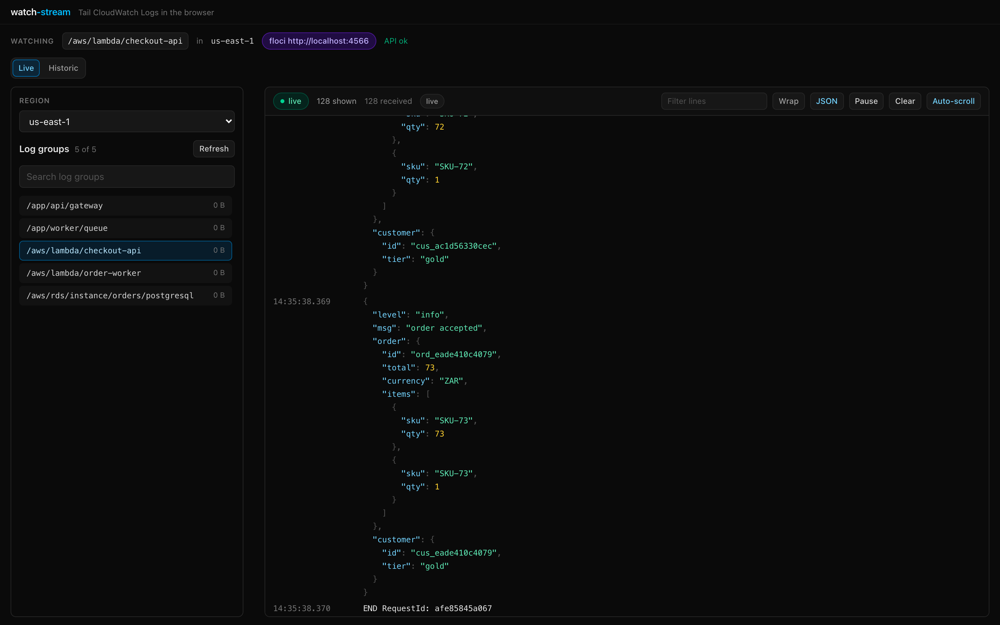

<div align="center">

# watch-tail

**Your CloudWatch logs, in a real window, in one command.**

`npx watch-tail` starts a local UI, lists the log groups in your AWS account, and streams whichever one
you pick - live, or across any historic window. No config file, no credentials to paste, no browser
tab fighting the AWS console.

[](https://www.npmjs.com/package/watch-tail)
[](https://github.com/antstanley/watch-stream/actions/workflows/ci.yml)
[](./LICENSE)
[](package.json)



</div>

```bash
npx watch-tail                                              # uses your ambient AWS credentials
npx watch-tail --profile my-profile --region af-south-1      # or a specific profile and region
npx watch-tail --floci                                      # or a local emulator, no AWS account
```

## Why watch-tail?

Because the two things you have today are the AWS console and `aws logs tail`, and both make you
work for every line.

- **The console is a form-filling exercise.** Region dropdown, log-group dropdown, sometimes a stream
  dropdown, then a text-only event viewer that forgets where you were. `watch-tail` opens on your
  region, lists every group with its size, and starts streaming the moment you click one.
- **`aws logs tail` is a wall of text.** `watch-tail` gives you pause with buffering, client-side
  filtering, clear, auto-scroll, a 5 000-line ring buffer, and a stream-name column that is truncated
  with the full value on hover - so a 95-character Lambda stream name cannot push your message off
  screen.
- **Logs arrive as payloads, not prose.** JSON entries are pretty-printed with syntax colouring by
  default, and one toggle shows the raw line when you need the wire format.
- **"What happened an hour ago?" is the normal question.** Flip to **Historic** and scan 15 min, 1 h,
  3 h, 12 h, 24 h, 5 days - or pick a custom `from`/`to` window. The scan finishes on its own and the
  window lives in the URL, so `…&mode=historic&range=24h` is a shareable view of an incident.
- **Your credentials never move.** No keys to paste into a SaaS, no CLI to install into your CI, no
  vendor account: it uses the ambient AWS profile you already use, needs only two read-only IAM
  actions, and binds to loopback. Throwaway keys are used for a local emulator and only there.
- **It is one command and it goes away.** `npx watch-tail`, Ctrl+C. Nothing is deployed, nothing is
  sent anywhere, and there is no agent, sidecar or daemon to clean up.

Use it when you are debugging a Lambda, chasing an API Gateway 5xx, watching a worker drain a queue,
or handing a teammate a link that shows exactly the window you are staring at.

## What you get

- **Region-first UI** - pick a region, see its log groups (with stored size), click one to stream.
- **Live and historic** - follow new events over SSE, or scan a fixed window up to the 14 days
  CloudWatch Logs keeps.
- **A log window built for real logs** - horizontal scrolling or wrapping, JSON pretty-printing,
  drag-resizable stream-name column and group-list pane, level colouring, pause/clear/auto-scroll.
- **Shareable views** - region, group, mode and window all live in the URL.
- **Local emulation friendly** - `--floci` points at [floci](https://floci.io) on port 4566 for
  development without an AWS account.

## Install

```bash
npx watch-tail              # no install
pnpm add -g watch-tail      # or install once; `wt` is installed as a shorthand
```

Installed globally, the command is available as both `watch-tail` and the shorter `wt`:

```bash
wt --profile my-profile --region af-south-1
```

Requires Node 22 or newer (developed and tested on Node 24).

## CLI

```
watch-tail [options]

  -p, --profile <name>   AWS profile to use (default: ambient credentials)
  -r, --region <code>    Region to open on (default: profile region, else AWS_REGION)
      --endpoint <url>   Point the app at a local emulator instead of AWS
      --floci            Shorthand for --endpoint http://localhost:4566
      --port <number>    Port for the local UI (default 4517)
      --host <address>   Interface to bind (default 127.0.0.1, loopback only)
      --no-open          Do not open a browser window
      --print            Print the environment that would be used, then exit
      --list             List the AWS profiles found on disk, then exit
      --verbose          Log the server's own output
  -h, --help             Show this help
  -v, --version          Show the version
```

Shell completions come from [`@bomb.sh/tab`](https://bomb.sh):

```bash
source <(watch-tail complete zsh)     # zsh; bash, fish and powershell too
```

`--profile` sets `AWS_PROFILE` for the server process only. Nothing is written to disk, and any local
emulator settings are neutralized for that run, so a stray `.env.local` cannot redirect a real AWS run.

## AWS access

Credentials are **ambient**: resolved by the AWS SDK provider chain - SSO, shared config, environment
variables or an instance role.

```bash
aws sso login --profile my-profile
watch-tail --profile my-profile
```

Two read-only actions are enough; the app never writes logs:

```json
{
	"Version": "2012-10-17",
	"Statement": [
		{
			"Effect": "Allow",
			"Action": ["logs:DescribeLogGroups", "logs:FilterLogEvents"],
			"Resource": "*"
		}
	]
}
```

Scope `Resource` down with a log-group ARN pattern if you only need a subset.

**The region is optional.** Precedence is `--region`, then `AWS_REGION`/`AWS_DEFAULT_REGION`, then the
profile's own region, then `[default]` in `~/.aws/config`. Nothing resolvable produces a clear
`missing-region` message instead of a silent guess. Log groups, retention and events are per region,
so a group in `eu-west-1` will not appear under `us-east-2`.

### Local emulator

```bash
curl -fsSL https://floci.io/install.sh | sh
floci start
npx watch-tail --floci             # throwaway credentials are supplied automatically
```

## Development

```bash
pnpm install
pnpm dev                                  # SvelteKit dev server on http://localhost:5173
pnpm seed                                 # fixtures in the local emulator (--watch for live traffic)
pnpm dev:aws --profile my-profile         # dev server against a real profile
pnpm build                                # adapter-node build + the CLI in dist/
pnpm start                                # run the built CLI
```

| Command                     | What it does                                                |
| --------------------------- | ----------------------------------------------------------- |
| `pnpm check`                | `svelte-check` types                                        |
| `pnpm test:unit`            | vitest unit, component and integration projects             |
| `pnpm test:e2e`             | floci integration suite (`WATCH_STREAM_E2E=1`)              |
| `pnpm test:cli`             | the built CLI serves and stops cleanly (`WATCH_TAIL_E2E=1`) |
| `pnpm test:ui`              | Playwright smoke check of the UI against a running app      |
| `pnpm lint` / `pnpm format` | oxlint / oxfmt                                              |
| `pnpm knip`                 | unused files, exports and dependencies                      |
| `pnpm verify`               | all of the above plus the build                             |
| `pnpm publish:check`        | publint plus the exact tarball contents                     |

## Releasing

Releases use [changesets](https://github.com/changesets/changesets): a changeset is a small file
that records _what changed and how much it matters_, reviewed with the code. Pending changesets are
folded into one "Release: version packages" PR; merging it bumps the version and writes
`CHANGELOG.md`; the release workflow then stages that version to npm and tags the commit.

```bash
pnpm changeset        # describe the change; the Version PR does the rest
pnpm changeset status # preview the next version
```

Publishing is **staged**, not direct: the tarball lands in npm's staging area and a human approves it
before it goes live, so no npm token exists in the repository - authentication is GitHub OIDC trusted
publishing, scoped to the publish job. See [RELEASING.md](./RELEASING.md) for the concept, the
one-time setup and the approval flow.

## Architecture

```
Browser (SvelteKit client)
  |  GET /api/log-groups        group list for a region
  |  GET /api/stream            SSE: ready, log, ping, error, end
  v
SvelteKit server routes (Node)
  |  @aws-sdk/client-cloudwatch-logs   DescribeLogGroups + FilterLogEvents polling
  v
CloudWatch Logs API   -- ambient AWS credentials
  or floci on http://localhost:4566
```

The CLI (`src/cli/`) boots the packaged adapter-node server, waits for `/api/health` and opens a
browser. Full details, including the HTTP and SSE contract, are in [ARCHITECTURE.md](./ARCHITECTURE.md).

## Notes and limits

- CloudWatch Logs has no push API for reading, so the app polls `FilterLogEvents` (1 s by default,
  250 ms - 15 s configurable). Expect roughly a second of latency and one API call per second per open
  stream.
- `FilterLogEvents` only returns events from the last 14 days.
- The local server has no authentication: it binds to loopback and inherits your AWS permissions.
  Binding elsewhere prints a warning - only do it on a trusted network.
- floci omits `logStreamName` in `FilterLogEvents`, so the stream column stays empty locally; real AWS
  fills it.

## License

MIT - see [LICENSE](./LICENSE).
